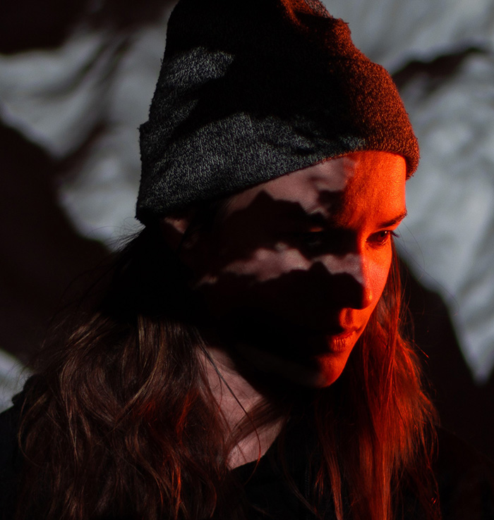
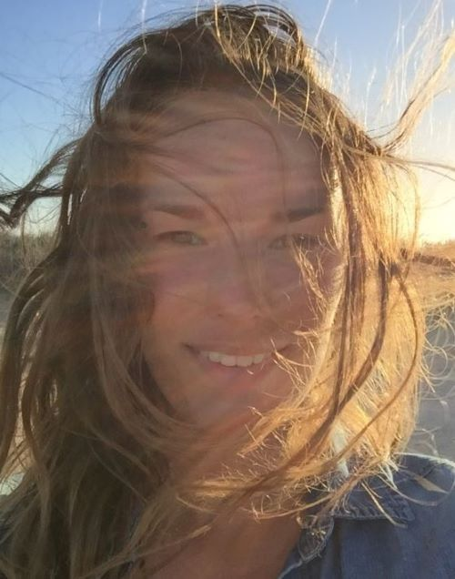

# Qui est Aude Guivarc'h?
Aude Guivarc'h est une artiste franco-canadienne de Montréal. Elle est réalisatrice ainsi qu'artiste des médias et du numérique, trouvant principalement ses inspirations dans ses passions qui sont la musique, la science et la nature. Pour mener à bien ses projets, Aude utilise abondamment la modélisation 3D, la sculpture, des installations interactives et l'art numérique, ce qui lui permet de captiver l'attention de nombreux spectateurs déjà impliqués 
dans de nombreux événements tels que OSHEAGA et MUTEK. Son travail se concentre exclusivement sur la durabilité environnementale et la justice sociale. Elle utilise des principes économiques de base tels que le recyclage et la réutilisation pour créer.

Ce qui est unique chez elle, c'est qu'elle utilise des matériaux qu'elle trouve dans des décharges pour créer ses projets. Ainsi, lorsque les clients hésitent à interagir avec une approche plus directe et dure sur ses projets, elle veut qu'ils comprennent que c'est précisément le but de son travail. Prenons par exemple *Caverne de Lave*. Pour interagir avec, le client doit appuyer fermement sur certaines parties des murs pour que celles-ci puissent réagir.

Elle a également remporté de nombreux prix pour son travail en 2021. Elle a été récompensée pour l'amélioration et le développement continu de son projet *Ecosystem Alpha* ainsi que pour le mapping vidéo audiovisuel de *Glaciers of Sound*.

Enfin, grâce à son esprit créatif et très ouvert, Aude a eu l'opportunité de collaborer et de travailler avec de nombreux grands artistes tels que Billie Eilish, Madonna, Ed Sheeran, Muse et Halsey au fil des années.

 
 
# Ressource
> **Site** https://guivar.ch/About-Aude
