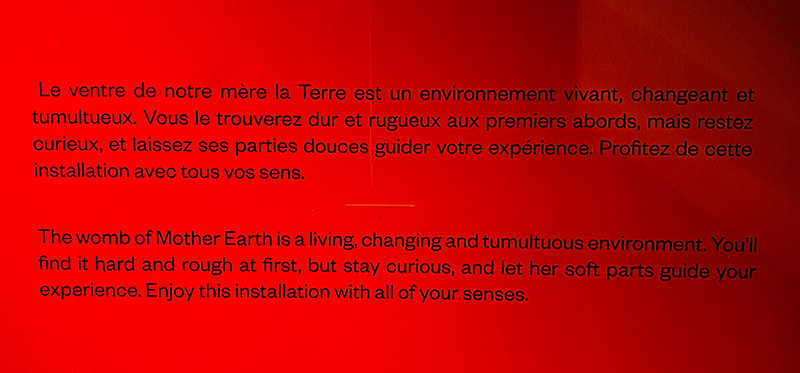
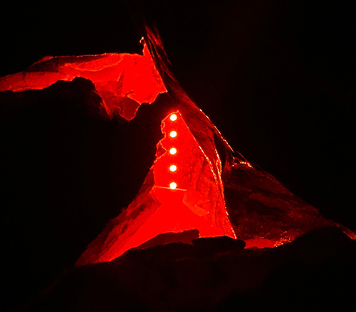
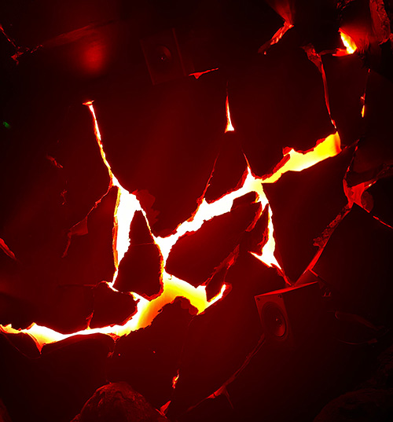

# Caverne de Lave
> *7049 Rue Saint-Urbain QC H2S 3H4*, Montréal, 03-02-24
 

## Description de l'oeuvre
La *Caverne de Lave*, également connue sous le nom de *Lava Cave* en anglais, est une installation multi-sensorielle dont l'objectif est de présenter l'énergie fondamentale de l'intérieur de la Terre. Ce projet a été réalisé en 2022. L'idée était que les clients viennent s'asseoir sur les roches conçues pour être des sièges et profitent de l'expérience audiovisuelle. Elle a été conçue pour avoir des parties dures et molles qui représentent physiquement la croûte terrestre et la lave, mais en réalité, elle vise à représenter les pouvoirs indéniables de la Terre. L'artiste a utilisé de nombreux composants techniques différents pour réaliser ce projet, et avec l'aide de ses connaissances étendues dans de nombreux domaines, elle a pu le faire seule. Ce projet a été conçu pour être à l'intérieur, évidemment, et temporaire, car malheureusement Age of Union changeait de lieu et fermait définitivement à Montréal.

## Types d'installation
Ce projet a utilisé des haut-parleurs pour le son, un projecteur pour le mapping, des petits capteurs séparés par un type de matériau spécial entre eux, de sorte que lorsqu'ils sont pressés, ils se connectent, ce qui permet au courant électrique de se rendre à l'ordinateur et lui indique qu'il y a eu un contact. Ainsi, en fonction de la force, de la douceur ou de la durée de l'interaction, la réaction sera différente. La cartographie vidéo (mapping video) précise utilise un logiciel, mais selon la guide, Aude a utilisé une version DIY pour cartographier sans utiliser de logiciel. 

Sur le site web, il est présenté plus précisement tous les matériaux qui ont été utilisés :
- [ ] Murs : Placoplâtre récupéré / Film vinyle récupéré / Contreplaqué / Bandes LED / Haut-parleurs
- [ ] Roches : Papier mâché (journaux récupérés, farine) / Treillis métallique d'occasion / Carton récupéré / Mousse récupérée / Contreplaqué récupéré / Plâtre récupéré / Fibre de verre / Par LED
- [ ] Sièges : Carton mousse (récupéré & d'occasion) / Contreplaqué / Béton léger écologique / Fibre de verre / Bandes LED / Transducteurs
- [ ] Multimédia & Électronique : Serveur multimédia d'occasion / Projecteur / Caisson de basses d'occasion

> **Site web:** https://guivar.ch/Lava-Cave

### Images du plan de design du projet

### Images descriptif de l'oeuvre

 

