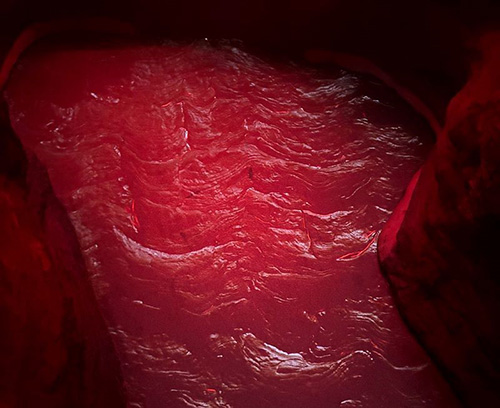

# Caverne de Lave - Aude Guivarc'h
> *7049 Rue Saint-Urbain QC H2S 3H4*, Montréal, 03-02-24
 

> *Photo prise par moi*

## Description de l'oeuvre
La *Caverne de Lave*, également connue sous le nom de *Lava Cave* en anglais, est une installation multi-sensorielle dont l'objectif est de présenter l'énergie fondamentale de l'intérieur de la Terre. Ce projet a été réalisé en 2022. L'idée était que les clients viennent s'asseoir sur les roches conçues pour être des sièges et profitent de l'expérience audiovisuelle. Elle a été conçue pour avoir des parties dures et molles qui représentent physiquement la croûte terrestre et la lave, mais en réalité, elle vise à représenter les pouvoirs indéniables de la Terre. L'artiste a utilisé de nombreux composants techniques différents pour réaliser ce projet, et avec l'aide de ses connaissances étendues dans de nombreux domaines, elle a pu le faire seule. Elle voulait que les gens se sentent comme s'ils étaient entourés dans un lieu différent de notre quotidien et elle voulait que les gens explorent et testent sans savoir exactement comment cela va fonctionner. Ce projet a été conçu pour être à l'intérieur et interactive, évidemment, et temporaire, car malheureusement Age of Union changeait de lieu et fermait définitivement à Montréal.

## Fonction
This oeuvre looks pretty complex but it's actually very simple to interact with. As said before, the visitors are invited to sit and look around the place. In order to interact with it, they must press on the soft parts in the walls and depending on how long and how hard they do so, the reactions will be different. Here are two pictures that show to different reactions:

 

## Types d'installation
Ce projet a utilisé des haut-parleurs pour le son, un projecteur pour le mapping, des petits capteurs séparés par un type de matériau spécial entre eux, de sorte que lorsqu'ils sont pressés, ils se connectent, ce qui permet au courant électrique de se rendre à l'ordinateur et lui indique qu'il y a eu un contact donc la réaction qui a été programmé va partir. Ainsi, en fonction de la force, de la douceur ou de la durée de l'interaction, la réaction sera différente. La cartographie vidéo (mapping video) utilise un logiciel, mais selon la guide, Aude a utilisé une version DIY pour cartographier sans utiliser de logiciel.

### Les composantes techniques
  
 
> *Photos prises par moi*

Sur le site web, il est présenté plus précisement tous les matériaux qui ont été utilisés :
- [ ] Murs : Placoplâtre récupéré / Film vinyle récupéré / Contreplaqué / Bandes LED / Haut-parleurs
- [ ] Roches : Papier mâché (journaux récupérés, farine) / Treillis métallique d'occasion / Carton récupéré / Mousse récupérée / Contreplaqué récupéré / Plâtre récupéré / Fibre de verre / Par LED
- [ ] Sièges : Carton mousse (récupéré & d'occasion) / Contreplaqué / Béton léger écologique / Fibre de verre / Bandes LED / Transducteurs
- [ ] Multimédia & Électronique : Serveur multimédia d'occasion / Projecteur / Caisson de basses d'occasion

### Images du plan de design du projet

> **Source:** https://guivar.ch/Lava-Cave

### Image descriptif de l'oeuvre

## Expérience générale
Il n'y a pas de guides pour expliquer comment tout fonctionne. L'objectif principal derrière le projet est que les visiteurs s'amusent et découvrent comment interagir avec, même s'il peut arriver que des personnes cassent des éléments. C'est ce qu'Aude voulait. Elle voulait vraiment que les gens se sentent entourés dans un endroit inhabituel et comprennent la puissance du noyau interne de notre planète.

## Expérience personnelle
Personnellement, j'ai beaucoup apprécié, j'ai trouvé cela très relaxant de m'asseoir là et d'essayer de comprendre comment cela fonctionne. Malheureusement, je n'ai pas pu saisir pleinement toutes les capacités du projet, même si on m'avait donné un indice sur la manière d'interagir avec lui, mais lorsque je suis allé sur le site web, j'ai vu que les lumières pouvaient changer de couleur et devenir plus lumineuses, par exemple. Donc, je pense que Aude a fait un travail formidable avec ce projet et la signification derrière celui-ci.

## Ressource
> **Source** https://guivar.ch/

