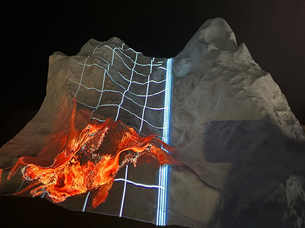
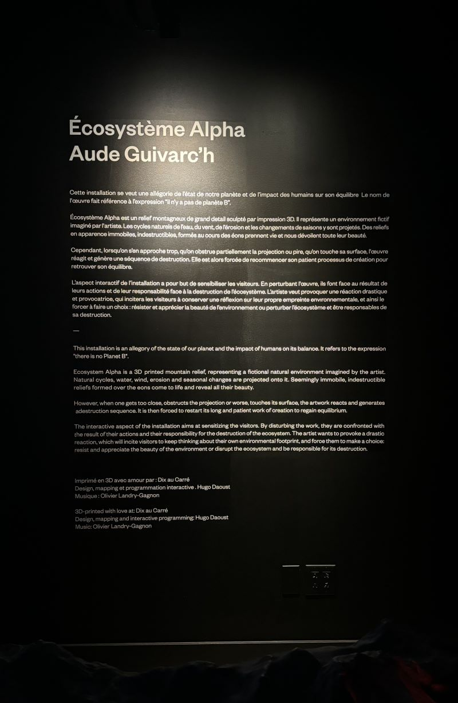

# Écosystème Alpha - Aude Guivarc'h
> *7049 Rue Saint-Urbain QC H2S 3H4*, Montréal, 03-02-24

> *Photo prise par moi*

## Description de l'oeuvre
Écosystème Alpha est un projet de sculpture interactive de vidéo-mapping créé en 2023. C'est une allégorie de l'état de notre planète et son objectif est de montrer qu'il n'y a pas de planète B après celle-ci. Il utilise précisément le vidéo-mapping pour créer ce qui serait une simulation des quatre saisons et du cycle naturel de la vie. Cela permet aux spectateurs de s'immerger et de vivre le cycle de la vie devant leurs yeux. Cependant, lorsque les spectateurs s'approchent trop près du terrain montagneux, celui-ci commence à s'autodétruire et en fonction de la durée pendant laquelle ils restent dans cette position, il faudra beaucoup de temps pour que la "Terre" reconstruise son bel environnement. Ainsi, de manière très simple, le projet montre comment les humains ont détruit la planète au fil des ans.

## Fonction
Écosystème Alpha est assez facile à comprendre dans son fonctionnement car son apparence est simple. Ainsi, les visiteurs sont invités à s'approcher de la surface, et une fois assez proches, le projet est programmé pour s'autodétruire. En d'autres termes, la cartographie changera et ne sera plus aussi belle qu'auparavant. Des images montrant clairement le changement seront présentées dans la section avant, pendant et après la destruction.

## Types d'installation
Pour que tout cela se réalise, Aude a dû passer par de nombreuses étapes différentes. Pour commencer avec la conception de la surface du projet, elle est allée en studio pour créer la forme réelle de la montagne à concevoir en utilisant la modélisation 3D pour imprimer la sculpture. Ensuite, du côté technique, elle a utilisé un système interactif, un Kinect 2.0 Xbox, le vidéo-mapping et la programmation pour capturer les mouvements et la portée, un projecteur 4K, un système audio stéréo pour le son, et bien sûr un bon ordinateur pour utiliser TouchDesigner. Elle a aussi utilisé un filament PLA recyclé post-consommateur provenant de déchets d'emballages alimentaires. Voici quelques images du tout:

### Conception de la sculpture

> **Source:** https://guivar.ch/Ecosystem-Alpha_v-3-0

### Les composantes techniques

  

### Avant, pendant et après la destruction

 
 
> *Photos prises par moi*

### Image descriptif de l'oeuvre

## Expérience générale
Le spectateur est invité à s'approcher de l'affichage et peut apprécier de voir les designs se déplacer, changer de couleur et de motifs. Cela les incite à vouloir toucher la sculpture, mais dès qu'ils le font, le projet est programmé pour s'autodétruire.

## Expérience personnelle
Personnellement, j'ai aimé l'idée qui se cachait derrière. Je trouve que c'était tellement logique que dès qu'il y a un contact avec la sculpture, la destruction commence, car cela montre vraiment la vérité derrière ce qui se passe dans la réalité. Et c'est que les humains sont le principal problème concernant la situation du changement climatique.

## Appréciation
Ce que j'ai vraiment aimé dans ce projet, c'est la partie d'interaction. J'ai vraiment apprécié la façon dont il réagissait au contact proche. Quand j'ai entendu un bruit de craquement la première fois que j'ai approché ma main de la structure, j'ai pensé que quelque chose était cassé, mais j'ai vite réalisé que ce n'était pas le cas et que cela représentait la façon dont la Terre réagit au contact humain. Je trouve que c'est une façon si créative et sensible de représenter cela, c'est pourquoi j'aime ça. Encore une fois, je ne changerais rien car je pense que c'était un projet très bien réalisé également.

## Ressource
> **Source** https://guivar.ch/Ecosystem-Alpha_v-3-0

