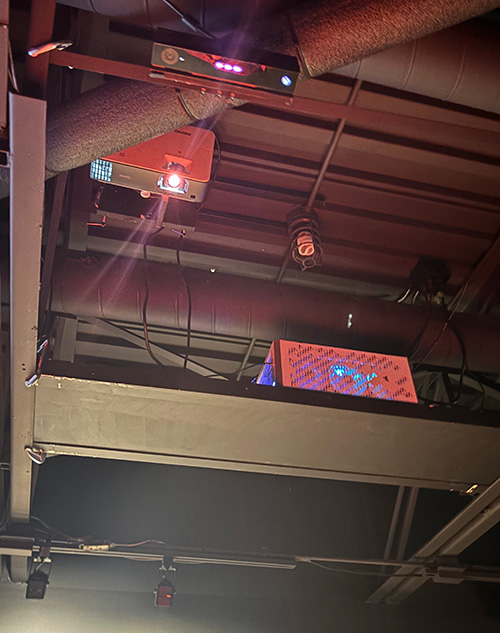

# Écosystème Alpha - Aude Guivarc'h
> *7049 Rue Saint-Urbain QC H2S 3H4*, Montréal, 03-02-24

> *Photo prise par moi*

## Description de l'oeuvre
Écosystème Alpha est un projet de sculpture interactive de vidéo-mapping créé en 2023. C'est une allégorie de l'état de notre planète et son objectif est de montrer qu'il n'y a pas de planète B après celle-ci. Il utilise précisément le vidéo-mapping pour créer ce qui serait une simulation des quatre saisons et du cycle naturel de la vie. Cela permet aux spectateurs de s'immerger et de vivre le cycle de la vie devant leurs yeux. Cependant, lorsque les spectateurs s'approchent trop près du terrain montagneux, celui-ci commence à s'autodétruire et en fonction de la durée pendant laquelle ils restent dans cette position, il faudra beaucoup de temps pour que la "Terre" reconstruise son bel environnement. Ainsi, de manière très simple, le projet montre comment les humains ont détruit la planète au fil des ans.

## Types d'installation
Pour que tout cela se réalise, Aude a dû passer par de nombreuses étapes différentes. Pour commencer avec la conception de la surface du projet, elle est allée en studio pour créer la forme réelle de la montagne à concevoir en utilisant la modélisation 3D pour imprimer la sculpture. Ensuite, du côté technique, elle a utilisé un système interactif, un Kinect 2.0 Xbox, le vidéo-mapping et la programmation pour capturer les mouvements et la portée, un projecteur 4K, un système audio stéréo pour le son, et bien sûr un bon ordinateur pour utiliser TouchDesigner. Elle a aussi utilisé un filament PLA recyclé post-consommateur provenant de déchets d'emballages alimentaires. Voici quelques images du tout:

### Conception de la sculpture

> **Source:** https://guivar.ch/Ecosystem-Alpha_v-3-0

### Les composantes techniques

  

### Avant, pendant et après la destruction

 
 
> *Photos prises par moi*

### Image descriptif de l'oeuvre

## Expérience générale
Il n'y a pas de guides pour expliquer comment tout fonctionne. L'objectif principal derrière le projet est que les visiteurs s'amusent et découvrent comment interagir avec, même s'il peut arriver que des personnes cassent des éléments. C'est ce qu'Aude voulait. Elle voulait vraiment que les gens se sentent entourés dans un endroit inhabituel et comprennent la puissance du noyau interne de notre planète.

## Expérience personnelle
Personnellement, j'ai beaucoup apprécié, j'ai trouvé cela très relaxant de m'asseoir là et d'essayer de comprendre comment cela fonctionne. Malheureusement, je n'ai pas pu saisir pleinement toutes les capacités du projet, même si on m'avait donné un indice sur la manière d'interagir avec lui, mais lorsque je suis allé sur le site web, j'ai vu que les lumières pouvaient changer de couleur et devenir plus lumineuses, par exemple. Donc, je pense que Aude a fait un travail formidable avec ce projet et la signification derrière celui-ci.

## Ressource
> **Source** https://guivar.ch/

