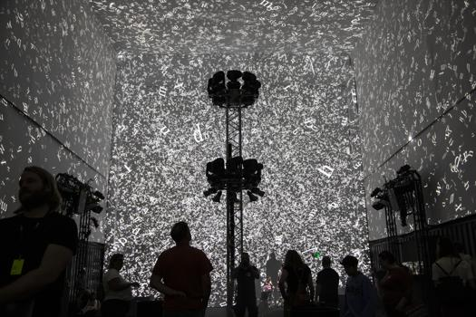

# Compte-rendu de la conférence sur Rafael Lozano-Hemmer
#### Nurlika Richard - 04/19/24

La conférence qui a été présentée le 16 avril 2024 portait sur les travaux du Studio Antimodular et sur l'artiste mexicain qui en est à l'origine. L'artiste est né en 1967 et possède une expertise en technologie et en science, c'est pourquoi ses projets sont presque toujours interactifs. Cet homme s'appelle Rafael Lozano-Hemmer et, ce jour-là, son travail était présenté par son registraire, Jade Séguéla. Comme mentionné précédemment, Jade est la seule et unique registraire du Studio Antimodular et elle s'occupe de tout l'équipement qui doit être déplacé lors de voyages internationaux. Non seulement qu'elle s'occupe de l'envoi à l'international, mais elle s'occupe également des importations et des exportations, de la logistique, des emballages des œuvres, du design des caisses, de la conservation préventive, du constat d'état, de la documentation, de l'inventaire des œuvres, de la gestion des œuvres en entrepôt et de l'installation des œuvres. Pendant la conférence, Jade a parler d'abord du studio Antimodular et de Rafael Lozano-Hemmer, des oeuvres de celui-ci et de l'interactivité, de son rôle à elle ainsi que son parcours. Et pour le corps de sa présentation, elle a aborder deux études de cas, le premier étant le fait de documenter une exposition d'art numérique et le deuxième était de produire une oeuvre pour une île déserte ce qui était le cas de *Translation Stream*.

Pour le premier cas d'étude, donc de documenter une exposition avant un envoi. Selon Jade, le tout prend environ cinq mois par bateau pour 

for the first case of study, she talked about how to document an exposition before sending of the equipements. The reason why they do documentation is very important. She said that it 

At the very beginning of the conference after the wgole introduction, she started explaining how important it was to document an exposition before sending it away. She noted that keeping track of everything is always a good thing to do. She gave an example that if before sending the equipments off, she says that she packed everything well but once they were recieved something was missing then without any documentation like a simple picture to prove herself right then she will be blamed and it will be her fault. This is why she always takes pictures of the equipments before and after the packaging. She then proceeded to talk about the more reasons why it is good to do this documentation. 

For one of their projects that was gonna be shown in Australia, the shipping took 5 months by boat. 
