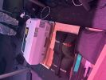
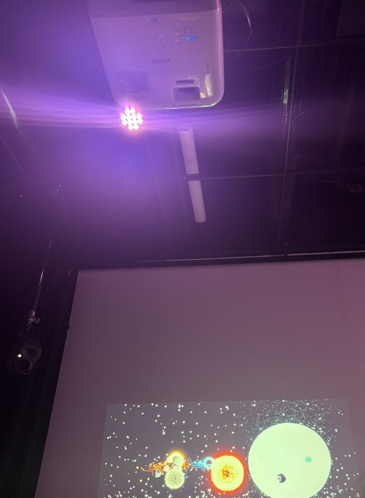
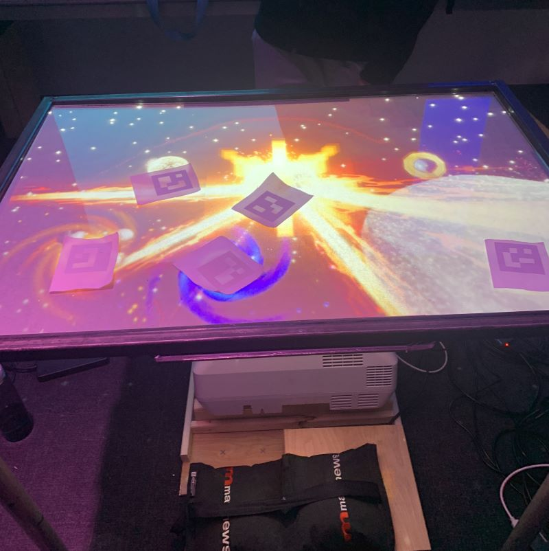
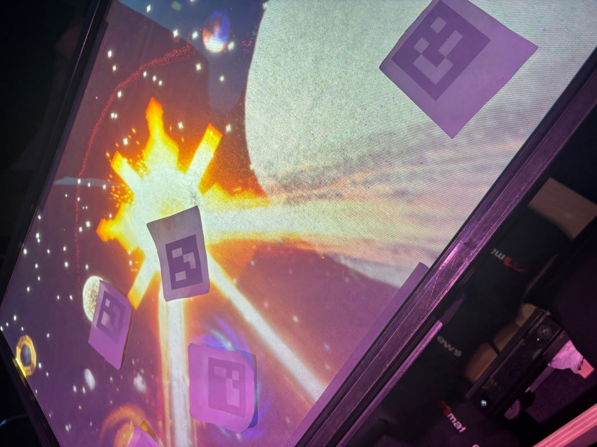
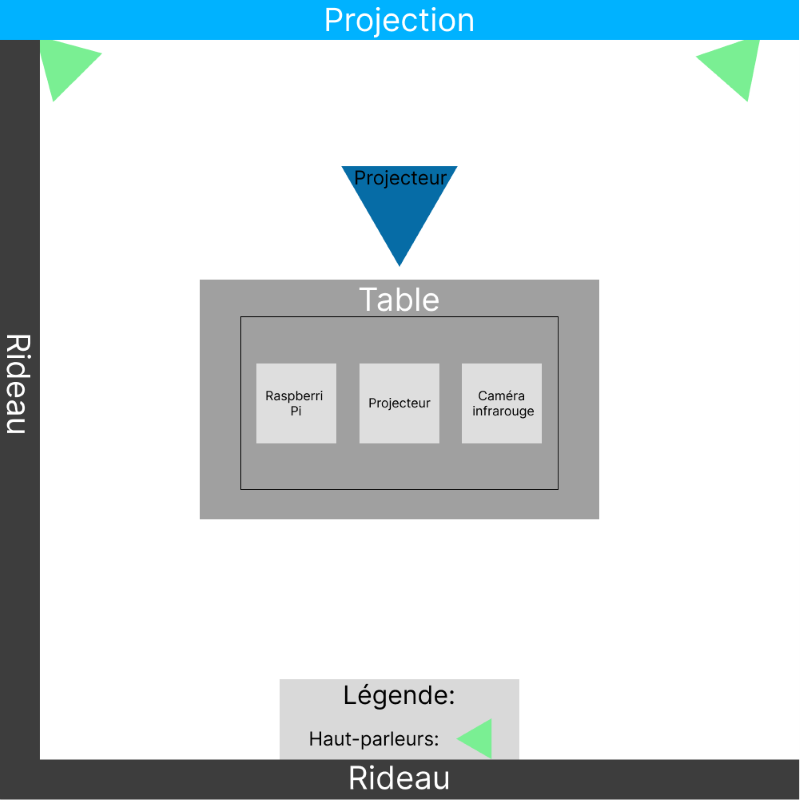
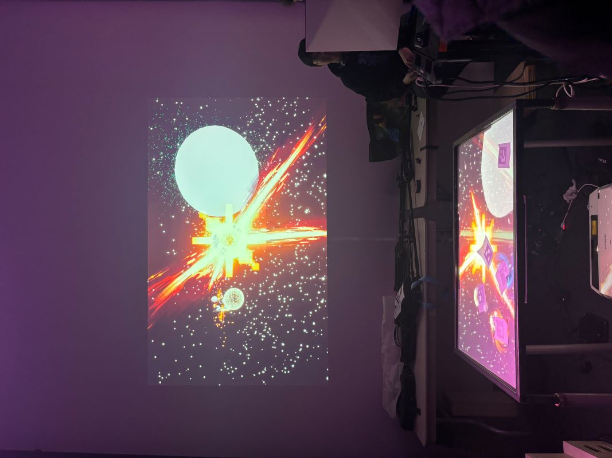

# Canevas Cosmique
> *Collège Montmorency*, Laval, 02-20-24

## Description du projet
Ce projet immersif est une simulation de l'espace. Il se déroule sur une table et à l'aide de différents types d'installations, il invite les utilisateurs à jouer avec les statues en papier qui fonctionnent comme des planètes.

## Les réalisateurs
Canevas Cosmique a été réalisé par:
- [ ] Jacob Alarie-Brousseau
- [ ] Étienne Charron
- [ ] Jérémy Cholette
- [ ] Quoc Huy Do
- [ ] Mikaël Tourangeau

## Types d'installation
Ce projet utilise les types d'installations de base comme deux projecteurs, l'un sous la table et l'autre au plafond, projetant sur le mur, des haut-parleurs et un ordinateur, mais il a également besoin de papiers qui sont des statues et qui portent des sens. Ces statues vont agir comme des planètes. Voici quelques images et un schéma:

### Projecteur sous la table

### Projecteur au plafond et haut-parleur

### Table

### Statues

### Schéma

> **Source:** https://tim-montmorency.com/2024/projets/Canevas-Cosmique/docs/web/preproduction.html

## Équipements
Voici quelques équipements qui ont été utilié pour réaliser ce projet: 

Audio: 
- Des haut-parleurs (2x)
- Des fils XLR 3 conducteurs de 15' (M->F) (4x)
- Une carte de son

Vidéo
- Des projecteurs vidéo shortrow (2x)
- Des systèmes d'acrochage (3x)
- Un caméra infrarouge

Électricité
- Des cordons IEC (pour l'alimentation des haut-parleurs) (2x)
- Des multiprises (2x)

Ordinateur
- Un ordinateur

[...]

> **Le reste de l'information sur les équipements peuvent être trouvé sur leur site web:** https://tim-montmorency.com/2024/projets/Canevas-Cosmique/docs/web/preproduction.html

## Les logiciels utilisés
L'équipe de Canevas Cosmique ont utilisé divers logiciels pour la réalisation de ce projet tels que TouchDesigner, VCV Rack, Reaper, OBS, Unity 2019 Its, Autodesk Maya et MadMapper. 

> ** Lien pour TouchDesigner: https://derivative.ca/

> ** Lien pour VCV Rack: https://vcvrack.com/

> ** Lien pour Reaper: https://www.reaper.fm/download.php

> ** Lien pour OBS: https://obsproject.com/

> ** Lien pour Unity 2019 Its: https://unity.com/

> ** Lien pour Autodesk Maya: https://www.autodesk.com/ca-fr

> ** Lien pour MadMapper: https://madmapper.com/

## Experience générale
L'intéracteur est invité à jouer avec les statues en les déplaçant. Cela agit comme le système solaire. Voici une image qui montre l'emplacement de tout:

## Experience personelle
Pour moi, ce fut une expérience intéressante. Je pensais que c'était amusant parce que c'était comme un jeu. Et les effets que cela produirait lorsque, par exemple, la statue du trou noir consommerait le soleil et créerait cette autre planète qui ressemblait un peu au bonbon spécial de Candy Crush, j'ai trouvé cela très cool et nostalgique.

## Référence
> **Site web:** https://tim-montmorency.com/2024/projets/Canevas-Cosmique/docs/web/index.html

