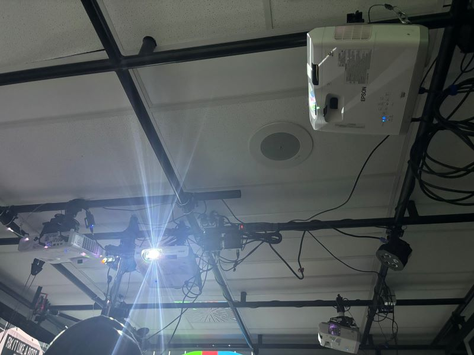
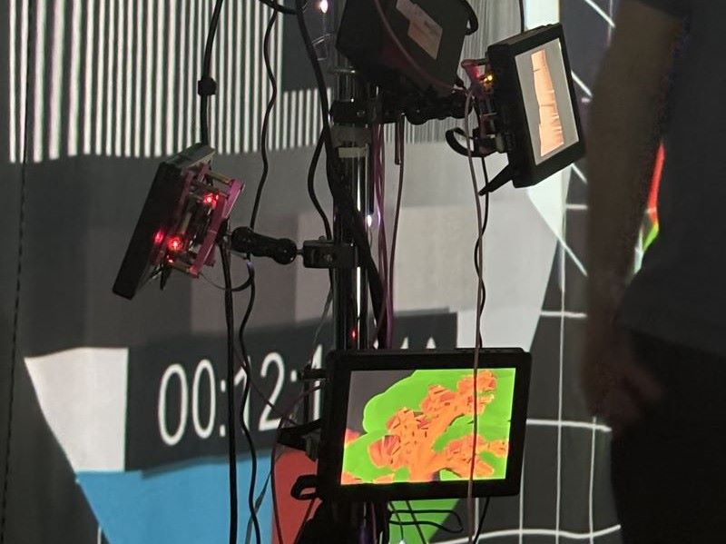
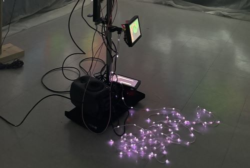
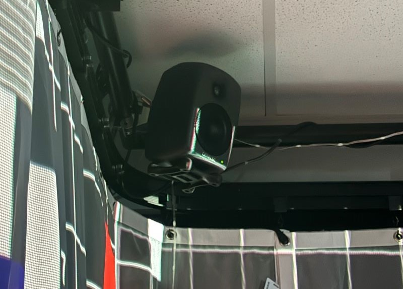
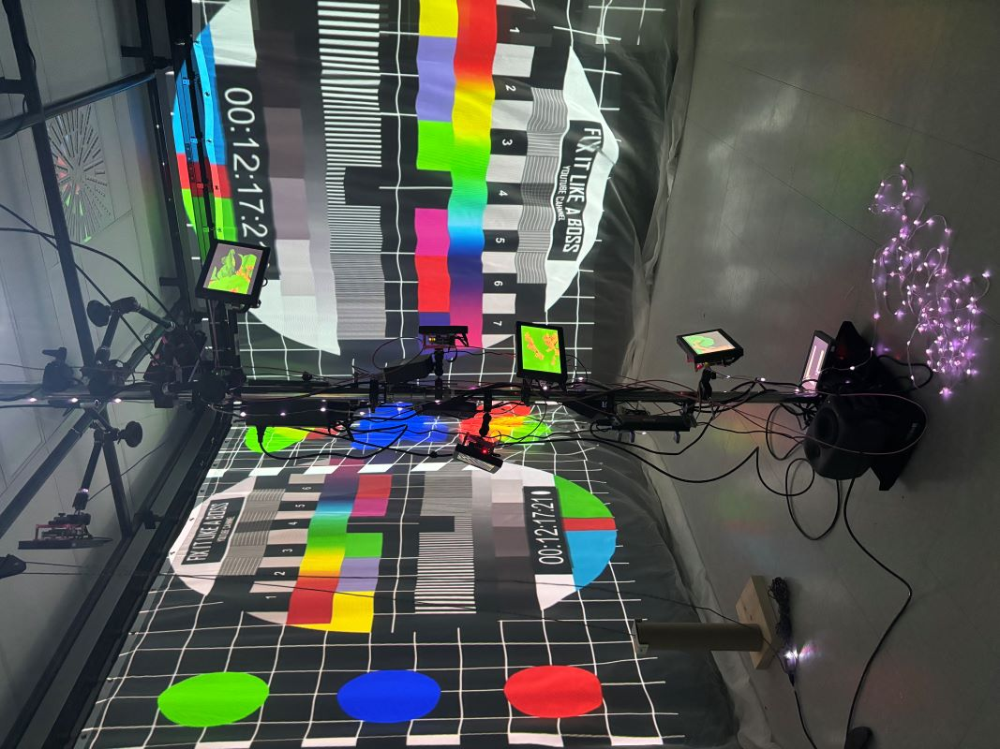

# 5. Effet Papillon
> *Collège Montmorency*, Laval, 02-20-24

## Description du projet
Effet Papillon est une installation interactive qui voit le cycle de vie d'un pommier en poursuivant l'effet papillon de plusieurs éléments électroniques tout en éduquant les intéracteurs.

## Les réalisateurs
Effet Papillon a été réalisé par:
- [ ] Raphaël Dumont
- [ ] Alexis Bolduc
- [ ] William Morel
- [ ] Alexia (Ryan) Papanikolaou
- [ ] Viktor Zhuravlev
- [ ] Jasmine Lapierre

## Types d'installation
Pour la réalisation d'Effet Papillon, l'équipe a utilisé divers types d'installation comme plusieurs projecteurs, un kinect, plusieurs écrans qui étaient accrochés autour du poteau au centre de la salle, des hauts-parleurs et des lumières. Voici quelques images et un plantation:

### Les projecteurs

### Écrans

### Lumières

### Haut-parleur

### Plantation

> **Source:** https://github.com/Iteration6/Effet-Papillon/blob/2b2e73f72208211f2ff77f123d528beb9cf9ef03/docs/preproduction/medias/Plantation_01.jpg

## Équipements
Voici quelques informations des équipements de ce projet:

- Ultra short throw (Projecteurs)
- Ordinateur portable
- Extender HDMI
- Des écrans
- Un kinect V2
- Lumière DMX	
[...]

> **Le reste de l'information sur les équipements peuvent être trouvé sur leur site web:** https://tim-montmorency.com/2024/projets/Effet-Papillon/docs/web/preproduction.html

## Les logiciels utilisés
Pour cette installation l'équipe d'Effet Papillon ont utilisé divers logiciels pour la réalisation de ce projet tels que QLC +, Touch Designer, Mad Mapper, Arduino, HyperHDR, FL Studio, Visual Code Studio et Blender.

> ** Lien pour QLC+: https://www.qlcplus.org/

> ** Lien pour TouchDesigner: https://derivative.ca/UserGuide/TouchDesigner

> ** Lien pour MadMapper: https://madmapper.com/

> ** Lien pour Arduino: https://www.arduino.cc/

> ** Lien pour HyperHDR: https://github.com/awawa-dev/HyperHDR

> ** Lien pour FL Studio: https://www.image-line.com/fl-studio/

> ** Lien pour Visual Code Studio: https://code.visualstudio.com/

> ** Lien pour Blender: https://www.blender.org/

## Expérience générale
L'intéracteur est invité à directement interagir avec la structure pour changer l’environnement qui est autour de lui et celui de la structure. Voici une image de la structure:

### Structure Effet Papillon

## Expérience personnelle
Je n'ai pas eu l'occasion d'en faire l'expérience, mais j'ai pu voir ce qui se passe lorsqu'on interagit avec lui. Je pense que c'est un beau projet, mais il me semble qu'il est un peu plus compliqué que les autres à mon avis à cause de son apparence physique et l'idée de le recréer semble très complexe.

# Référence
> **Site web:** https://tim-montmorency.com/2024/projets/Effet-Papillon/docs/web/index.html

