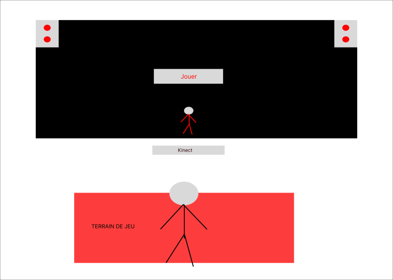

# Kigo
> *Collège Montmorency*, Laval, 02-20-24

## Description du projet
Cette installation est un jeu interactif et immersif puisqu'il demande au joueur d'éviter les obstacles qui sont inspirés d'un style visuel néon rétro. De plus, l'esthétisme de celui-ci changera de temps en temps pour s'associer qux quatres saissons. Le but de ce jeu est principalement d'éviter des obstacles et amasser des points. 

## Les réalisateurs
Kigo a été réalisé par:
- [ ] Érick Ouellette
- [ ] William Rathier Mailly
- [ ] Gabriel Clerval
- [ ] Nicolas St-Martin
- [ ] Antoine Dion

## Types d'installation
La réalisation de Kigo a utilisé divers types d'installation comme des haut-parleurs, un projecteur, un kinect et un ordinateur. Voici quelques images et un scénarimage:

### Le projecteur et haut-parleur

### Kinect

### Ordinateur

### Scénarimage

> **Source:** https://tim-montmorency.com/2024/projets/Kigo/docs/web/preproduction.html

## Équipement
Voici quelques informations des équipements:

L'audio:
- Un console de sons
- Une carte de sons
- Deux haut-parleurs Genelec 8010APM
- Quatre câbles XLR (M->F) (Longueur minimale estimée entre 4-6 mètres)
  
Vidéo: 
- Un projecteur
- Un kinect V2
- Un système d'acrochage pour le projecteur

Réseau:
- Deux fils Ethernet (longueur minimale estimée entre 4-8 mètres)
- Un HDMI Extender
- Deux câbles HDMI
Un câble displayPort

Ordinateur:
- Un chariot Ordinateur avec ordinateur

[...]

> **Le reste de l'information sur les équipements peuvent être trouvé sur leur site web:** https://tim-montmorency.com/2024/projets/Kigo/docs/web/preproduction.html

## Les logiciels utilisés
L'équipe de Kigo ont utilisé divers logiciels pour réaliser leur projet tels que Kinect studio, Unity, Touch designer (Si Unity ne marche pas), Blender ou Maya, OBS Studio, Reaper.

> ** Lien pour Kinect Studio: https://github.com/Kinect/Docs/blob/master/Kinect4Windows2.0/k4w2/NUI_Tools/Kinect_Studio.md

> ** Lien pour  Unity: https://unity.com/fr

> ** Lien pour Touch designer: https://derivative.ca/

> ** Lien pour Blender: https://www.blender.org/

> ** Lien pour Maya: https://www.autodesk.com/ca-fr/products/maya/free-trial

> ** Lien pour OBS Studio: https://obsproject.com/fr

> ** Lien pour Reaper: https://www.reaper.fm/

## Expérience générale
Le but de ce jeu est principalement d'éviter des obstacles et d'amasser des points. Au fur et à mesure, l'apparition des obstacles vont devenir plus rapide. C'est grâce au kinect que l'avatar peut apparaître. Voici une image de l'avatar qui est en jaune (celui en vert n'est pas un joueur mais le kinect a quand même réussi à capter ses mouvements et de les transmettre pour le présenter):

## Expérience personelle
Je n'ai pas pu l'essayer donc je ne peux pas vraiment dire grand chose, mais ce que je peux dire c'est que ça me rappellait un peu de Just Dance et de Beat saber juste à cause de l'avatar et des obstacles et c'est pourquoi je vais dire que ça avait l'air amusant. Voici une image de quelqu'un entrain de jouer:

# Référence
> **Site web:** https://tim-montmorency.com/2024/projets/Kigo/docs/web/index.html
