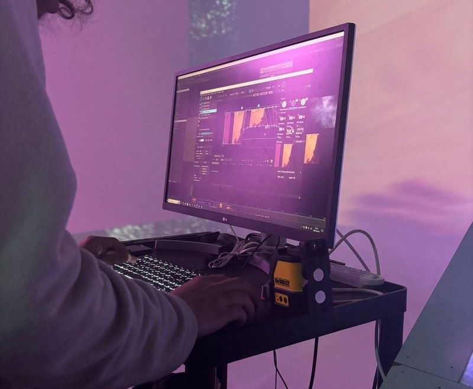
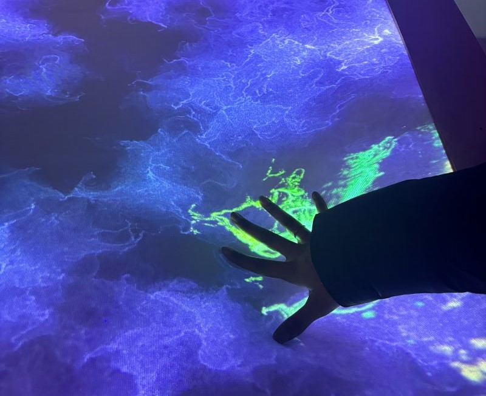
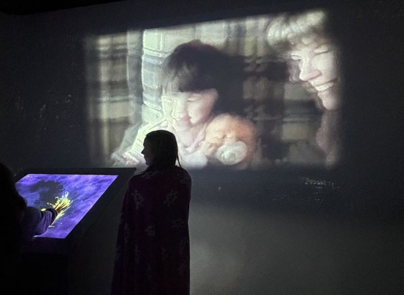
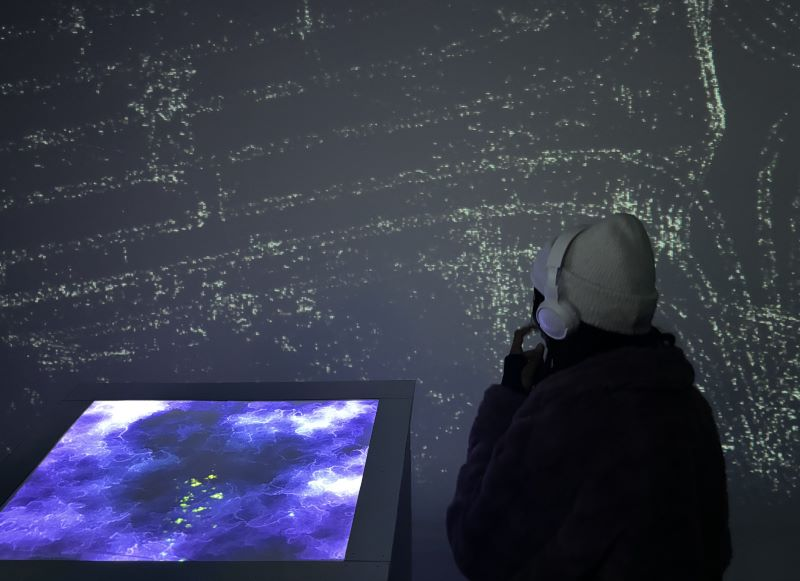

# 3. Rhizomatique
> *Collège Montmorency*, Laval, 02-20-24

## Description du projet
Rhizomatique est une installation immersive qui est séparée en deux parties: la toile et les projections qui sont immersives. Ce projet permet à l'intéracteur de voyager dans ces souvenirs en appuyant sur une toile. Après l'intéraction, les projections vont reprendre leur position initiale jusqu'à la prochaine intéraction.

## Les réalisateurs
Rhizomatique a été réalisé par:
- [ ] Jolyanne Desjardins
- [ ] Maïka Désy
- [ ] Laurie Houde
- [ ] Felix Testa Radovanovic

## Types d'installation
Pour pouvoir réaliser ce projet, l'équipe a utilisé divers types d'installation comme deux projecteurs, car avec seulement un plus que c'est loin, le moins il y aura de lumière alors se sera insuffisant, un kinect, une machine qui détecte l'infrarouge et un cyclorama (l'interface sur lequel les souvenirs sont projetés). Voici quelques images et un croquis:

### Les projecteurs

### La toile

### Projection sur le cyclorama

### Ordinateur

### Croquis

> **Source:** https://tim-montmorency.com/2024/projets/Rhizomatique/docs/web/preproduction.html

## Équipements
Voici quelques informations des équipements qui peuvent être trouvé sur leur site et qui ont été utilisé pour la réalisation de ce projet:

L'audio:
- Des haut-parleurs actifs de 4" (4x)
- Des fils XLR 3 conducteurs de 15' (5x)
- Powercon
  
Vidéo: 
- Des systèmes d'acrochage (4x)
- Des kinects (2x)
- Des cables HTMI (3x)

Lumière:
- Une lumière LED RGBAW DMX
- Des fils XLR 3 conducteurs de 20' (2x)
- Powercon

Électricité:
- Des cordons IEC pour alimenter les haut-parleurs (2x)
- Des extentions (2x)

Ordinateur:
- Un ordinateur portable

[...]

> **Le reste de l'information sur les équipements peuvent être trouvé sur leur site web:** https://tim-montmorency.com/2024/projets/Rhizomatique/docs/web/preproduction.html

## Les logiciels utilisés
L'équipe de Rhizomatique ont utilisé divers logiciels pour la réalisation de ce projet tels que TouchDesigner, VCV Rack 2, QLC+, MadMapper et DaVinci Resolve. 

> ** Lien pour TouchDesigner: https://derivative.ca/

> ** Lien pour VCV Rack 2: https://vcvrack.com/Rack

> ** Lien pour QLC+: https://www.qlcplus.org/

> ** Lien pour MadMapper: https://madmapper.com/

> ** Lien pour DaVinci Resolve: https://www.blackmagicdesign.com/ca/products/davinciresolve

## Expérience générale
L'intéracteur est invité à appuyer sur la toile. Grâce au capteur d'infrarouge et des kinects ceci va permettre l'interaction avec les vidéos sur le cyclorama. À chaque fois que celui-ci appuye sur la toile qui représente une simulation du cerveau, un espèce de modèle ou tracé va apparaitre sous la main et cela est programmé à changer les souvenirs qui apparaitront sur le cyclorama. Voici une image:

### Main sur toile

## Expérience personelle
Honnêtement, j’adore l’idée derrière le projet, car c’est vrai que le temps passe si vite sans même qu’on le sache parfois. Alors créer un projet comme celui-ci pour nous permettre de revoir certains de nos précieux souvenirs, je pense que c'est une bonne chose. Quand l'équipe m'a dit que je pouvais appuyer plus fort sur la toile, j'étais un peu choquée, car je pensais que j'allais la casser, mais c'était satisfaisant d'une certaine manière. Je pense qu'avec un peu plus de travail, leur projet peut vraiment aller quelque part.

## Après la finition - Semaine 7
Voici deux images qui representent bien le projet final.

# Référence
> **Site web:** https://tim-montmorency.com/2024/projets/Rhizomatique/docs/web/index.html
