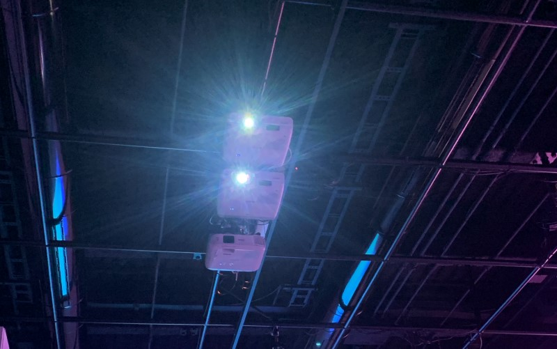
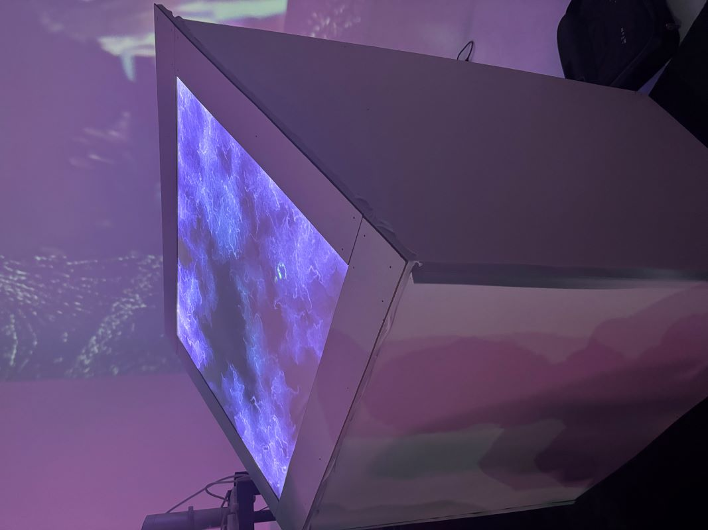
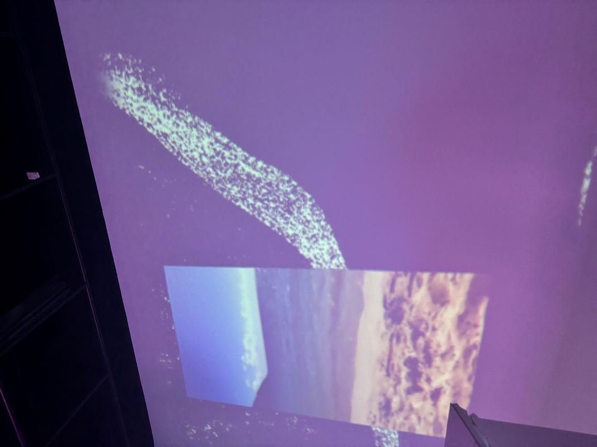
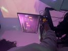
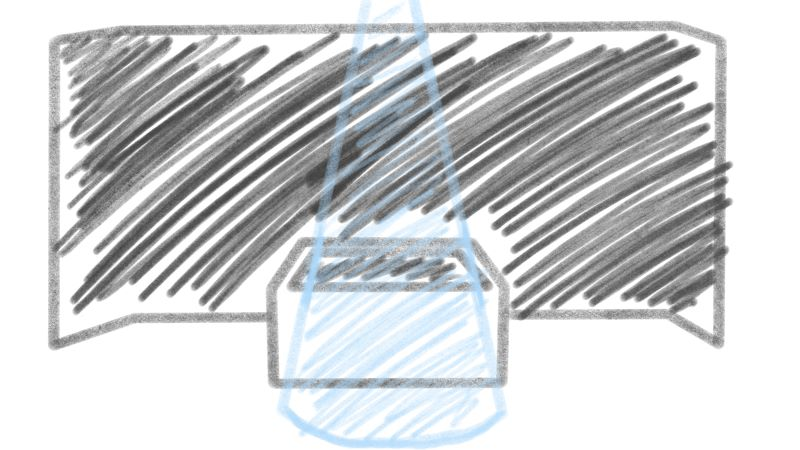

# Rhizomatique
(Date de visite: 02-20-24)

## Description du projet
Rhizomatique est une installation qui est séparée en deux parties: la toile et les projections qui sont immersives. Ce projet permet à l'intéracteur de voyager dans ces souvenirs en appuyant sur une toile. Après l'intéraction, les projections vont reprendre leur position initiale jusqu'à la prochaine intéraction.

## Les réalisateurs
Rhizomatique a été réalisé par:
- [ ] Jolyanne Desjardins
- [ ] Maïka Désy
- [ ] Laurie Houde
- [ ] Felix Testa Radovanovic

## Types d'installation
Pour pouvoir réaliser ce projet, l'équipe a utilisé divers types d'installation comme deux projecteurs, car avec seulement un plus que c'est loin, le moins il y aura de lumière alors se sera insuffisant, un kinect, une machine qui détecte l'infrarouge et un cyclorama (l'interface sur lequel les souvenirs sont projetés). Voici quelques images et un croquis:

### Les projecteurs

### La toile

### Projection sur le cyclorama

### Ordinateur

### Croquis

> **Source:** https://tim-montmorency.com/2024/projets/Rhizomatique/docs/web/preproduction.html

## Les équipements
Voici quelques informations des équipements qui peuvent être trouvé sur leur site et qui ont été utilisé pour la réalisation de ce projet:

L'audio:
- Des haut-parleurs actifs de 4" (4x)
- Des fils XLR 3 conducteurs de 15' (5x)
- Powercon
  
Vidéo: 
- Des systèmes d'acrochage (4x)
- Des kinects (2x)
- Des cables HTMI (3x)

Lumière:
- Une lumière LED RGBAW DMX
- Des fils XLR 3 conducteurs de 20' (2x)
- Powercon

Électricité:
- Des cordons IEC pour alimenter les haut-parleurs (2x)
- Des extentions (2x)

Ordinateur:
- Un ordinateur portable

[...]

(Le reste de l'information sur les équipements peuvent être trouvé sur leur site web: https://tim-montmorency.com/2024/projets/Rhizomatique/docs/web/preproduction.html)

## 
