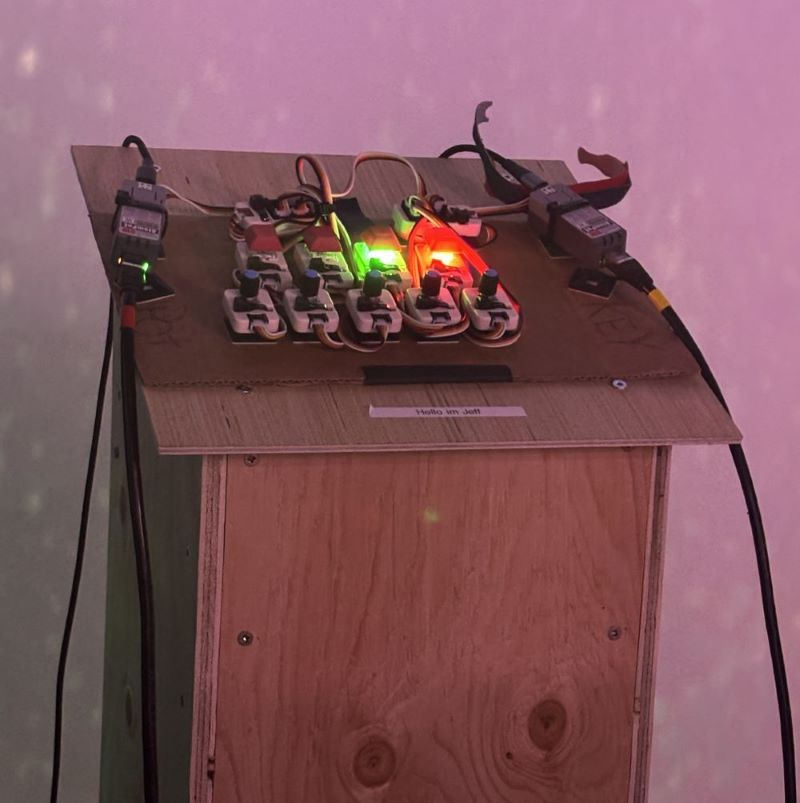
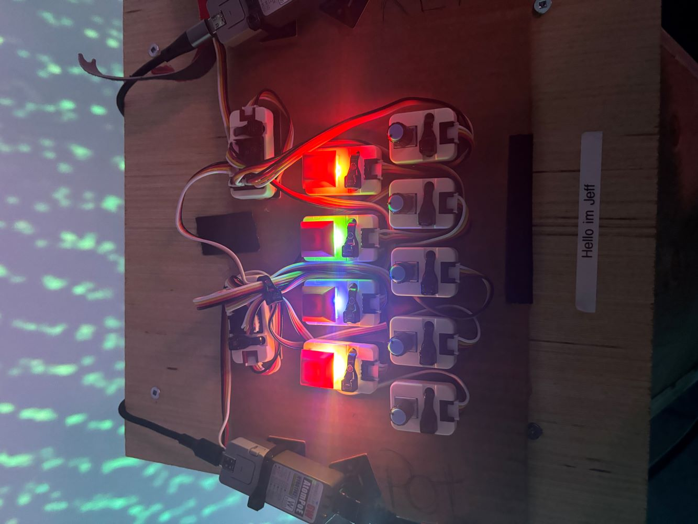
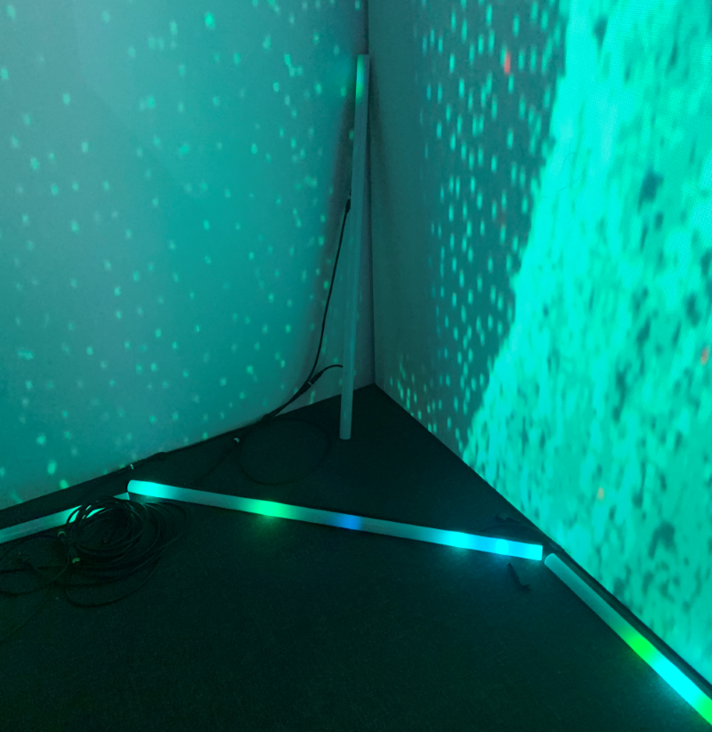
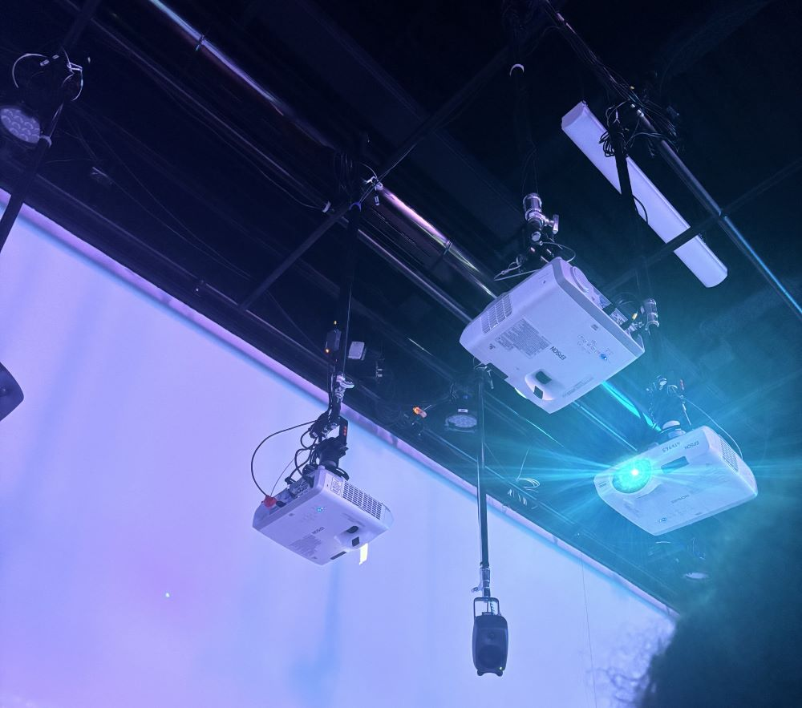
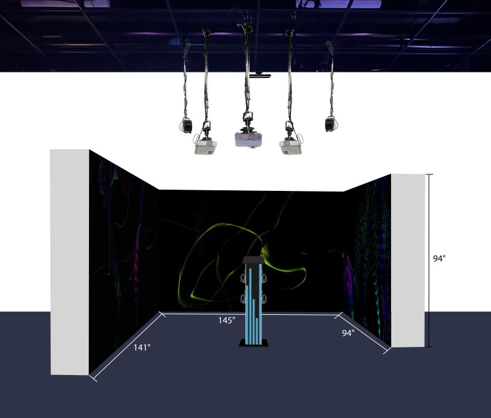

# Solanux
(Date de visite: 02-20-24)

## Description du projet

Sonalux est une installation qui a comme but de projeter son utilisateur dans un monde qui favorise un voyage astral. Ceci est réalisé grâce à la manipulation de pièces d'instruments qui sont sur un panneau de contrôle. Il s’agit d’un projet qui a été réalisé par des étudiants de troisième année de la technique d’intégration multimédia de l'école Montmorency. Ce projet a pris environ un mois à faire.

## Les réalisateurs
Sonalux a été réalisé par:
- [ ] Antoine Haddad
- [ ] Camélie Laprise
- [ ] Ghita Alaoui
- [ ] Vincent Desjardins

## Types d'installation
Ce projet est immersif, car il permet à ses utilisateurs d'intéragir avec lui en utilisant les écouteurs qui leur sont fournis et qui est connecté au panneau. En manipulant les unités de touches (key units) et les potentiomètres, il enverra des sons musicaux aux écouteurs. Et grâce aux projecteurs, des lumières apparaîtront une fois qu'une action aura été effectuée sur le panneau par l'utilisateur. De plus, le projet se passe entre 3 murs au total dont 2 sont mobiles, comporte trois projecteurs, 2 haut-parleurs et un Kinect qui sert à controller une interface sans l'utilisation d'une manette. Voici quelques images et un croquis des installations:

### Panneau de contrôle

 

### Controleur (Potensomètre et Unités de touches (Key Unité))

### Lumières

### Projecteurs et Haut-Parleurs

### Croquis

 

(Source: https://tim-montmorency.com/2024/projets/Sonalux/docs/web/preproduction.html)

## Équipements
Voici les équipements qui ont été utilisé pour faire:

L'audio:
- Carte de son
- Des casques d'écouteurs (4x)
- Une interface audio USB qui a 8 sorties et au moins 1 entrée
- Des haut-parleurs actifs de 4" (2x)
- Des fils XLR 3 conducteurs de 15' (M->F) (4x)

L'électricité:
- Des cordons IEC qui servivont à l'alimentation des haut-parleurs (4x)
- Deux extentions, trois fiches et trois conducteurs
- Deux multiprises

La vidéo:
- 3 projecteurs vidéo lentille grand angle 0.5

L'ordinateur: 
- 2 ordinateurs dont un est portable et l'autre est sur un chariot

Le réseau:
- 4 fils cat6a de 15"
- Switch POE 5 ports

La lumière: 
- Tubes DEL

[...]

(Le reste peuvent se trouver sur leur site: https://tim-montmorency.com/2024/projets/Sonalux/docs/web/preproduction.html)

## Les logiciels utilisés
Les réalisateurs de Sonalux avec l'aide de TouchDesigner, VCV Rack et d'arduino IDE, ont pu réalisés le tout. TouchDesigner est un logiciel basé sur une programmation visuelle qui permet des interactions instantanées et VCV Rack est un synthétiseur virtuel gratuit et open source et Arduino IDE est un autre language de programmation.

## Experience général
L'interacteur se positionne devant le podium, met les écouteurs et commence à jouer avec les unités de touches (Key units) et potentiomètres. Ceci entrainera des sons dans les écouteurs se qui permettra à l'interacteur de s'amuser en créeant des morceaux de musique. En même temps, les projecteurs et les lumières vont bouger dépendemment de ce qui va être bouger sur le podium.

## Mon experience personel
Mon expérience avec Sonalux a été très intéressante. J'ai eu l'occasion de le tester et c'était très amusant. Au début, j'étais un peu confus quant à ce que je faisais exactement, mais ensuite j'ai compris et j'ai même essayé de faire une chanson avec. C'était très amusant et poétique d'une certaine manière. Je trouve que ça pique assez l'intérêt de l'utilisateur ce qui est très bon.

## Référence
(Site web: https://tim-montmorency.com/2024/projets/Sonalux/docs/web/index.html)
