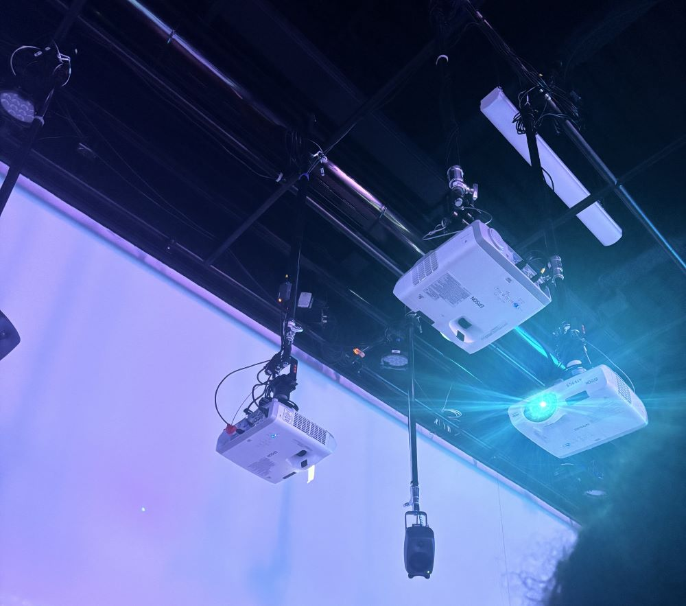

# Solanux

## Description du projet

Sonalux est une installation qui a comme but de projeter son utilisateur dans un monde qui favorise un voyage astral. Ceci est réalisé grâce à la manipulation de pièces d'instruments qui sont sur un panneau de contrôle. Il s’agit d’un projet qui a été réalisé par des étudiants de troisième année de la technique d’intégration multimédia de Montmorency. Ce projet a pris environ un mois à faire.

## Les réalisateurs
Sonalux a été réalisé par:
- [ ] Antoine Haddad
- [ ] Camélie Laprise
- [ ] Ghita Alaoui
- [ ] Vincent Desjardins

## Type d'installation
Ce projet est immersif, car il permet à ses utilisateurs d'intéragir avec lui en utilisant les écouteurs qui leur sont fournis et qui est connecté au panneau. En manipulant les unités de touches (key units) et les potentiomètres, il enverra des sons musicaux aux écouteurs. Et grâce aux projecteurs, des lumières apparaîtront une fois qu'une action aura été effectuée sur le panneau par l'utilisateur. Voici quelques images des installations:

 

##
##
##
