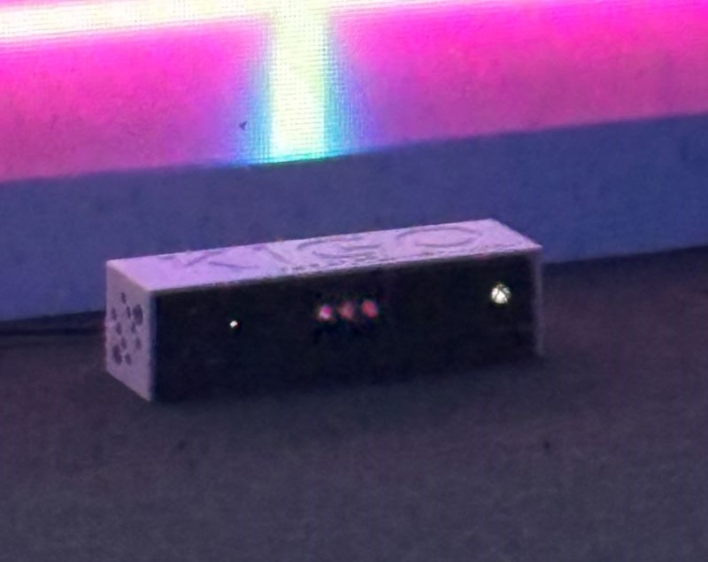

# Sommaire

## Thème Crescentia
Crescentia est le mot latin pour l’évolution. Il peut s’agir de n’importe quelle évolution, qu’elle soit psychologique ou environnementale, et c’est pourquoi les étudiants de troisième année ont choisi ce mot comme thème. C’est à partir de là qu’ils ont exploité le thème et ont utilisé ses nombreuses significations pour créer leur propre idée par rapport à ce qu'ils ont capté de ceci. Par exemple, le projet de l’effet papillion porte sur la croissance d’un pommier. Ainsi, tous les projets découvrent plus profondément la signification du mot Crescentia et sont représentés de manière unique.

## Trois cours utile pour créer ce type de projet
Selon moi le cours de web, d'audio et de programmation sont les trois cours qui sont incontournable pour crée ce genre de projet, car pour chacun 
des projets qui nous on été présenté, tous les membres ont mentionné d'avoir utiliser au moins les compétences de deux de ces cours. 

## Composante Technologique
Pour de nombreux projets qui ont été présentés, les membres ont utilisé un dispositif qui capte les mouvements du corps sans contact. Cet appareil est connu 
pour être appelé « kinect », mais il peut également être appelé « code projet natal ». Il a été créé par Microsoft. Les étudiants utilisaient 
principalement ce dispositif pour le suivi et la reconnaissance d’un sujet par exemple dans Canevas Cosmique, il était utilisé sous chaque statue à l’aide
des projecteurs et des logiciels ou encore dans Kigo, pour que l’avatar puisse suivre le joueur, c’était à l’aide de la kinect et de programmation.

