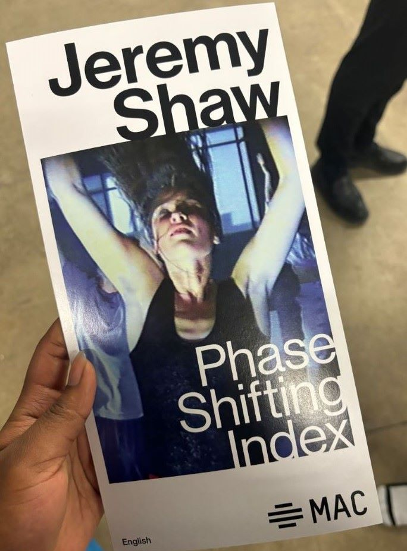

# Jeremy Shaw Phase Shifting Index

## Description de l’oeuvre
L’exposition de Jeremy Shaw a eu lieu au centre d’arts visuels, Fonderie Darling, qui se trouve à 745 Rue Ottawa à Montréal et a été réalisé en 2020. 

 

(image of me outside and of the title of the expo) Cette exposition avait comme but de montrer que parfois les gens cherchent à sortir de leur corps et à s’échapper de leurs réalités. Que parfois les humains cherchent à croire en quelque chose qui pourrait être au-delà d’eux ou qui est d’un état supérieur qu’eux. Elles expliquaient le sentiment transcendant que les gens éprouvaient. Ceci se trouve d’être l’inspiration principale du projet, car l’artiste dit d’être fasciné par la croyance que peuvent posséder les gens. (source : link the video of the interview – mac) 

## Cartel
C’est grâce à l’artiste et à la galerie d’arts contemporain de Montréal, Bradley Ertaskiran, qu’elle a été présentée avec succès dans de nombreux musées de différents pays tels que le Centre Pompidou à Paris, au MoMA PS1 à New York, au Schinkel Pavillon à Berlin et au MOCA à Toronto. (Source : Jeremy Shaw représenté par Bradley Ertaskiran - Bradley Ertaskiran )

## Types d’installation
En même temps d’être une expérience immersive grâce aux équipements utilisés qui interpellent les gens à se connecter aux sentiments et expériences des acteur(e)s, elle se trouvent d’être contemplative aussi. L’œuvre permet à l’audience de vivre un réel moment contemplatif et immersif en raison du temps et des efforts que les organisateurs ont mis pour le réaliser. Ils ont utilisé de nombreux types d’équipements comme les sept grands écrans et leurs bancs, les deux hauts-parleurs qui visaient chaque écran, les projecteurs, les câbles sur les grilles et les éclairages. 

## Mise en espace
En entrant dans la pièce, la première chose que l’on remarque est la taille de la pièce et sa taille. Ensuite, il y aurait les écrans et la façon dont ils sont placés. Chaque écran est séparé et espacé les uns des autres et sont accompagnés de leur propre banc. Voici un croquis et une image de la salle :

## Composantes et techniques
Bien sûr, puisque cette exposition s’est déroulée à l’étranger, cela signifie que l’équipage a dû apporter tout son équipement avec lui. Il a fallu beaucoup de réflexion et de planification pour s’assurer que tout était prêt à partir. N’oublions pas que si quelque chose s’est mal passé, il est fort probable qu’ils aient pensé être prêts pour les sauvegardes.

## Éléments nécessaires à la mise en exposition
Voici quelques photos des éléments nécessaires à la mise en exposition qui ont été nommés précédemment :

## Expérience vécue
Lors de leur première entrée dans le bâtiment, le(s) visiteur(e)s sont gentiments guidé(e)s par l’intéracteur ou l’intéractrice. Ensuite, ils sont amenés dans la salle avant la salle principale et peuvent s’asseoir à leur guise sur les bancs tout en étant introduits à l’exposition. Entrant dans les détails, l’intéracteur ou l’intéractrice, parle du parcours de l’artiste, de ses œuvres et plus encore. Après cette partie informelle, les visteur(e)s sont par la suite invités à vivre l’expérience à leur tour. L’exposition se compose de différentes séquences. Au début, chaque écran raconte sa propre histoire, puis tout le monde commence à danser de la même manière et après cela, tous les écrans commencent à glitcher et les acteur(e)s commencent à apparaître sur différents écrans, ce qui se termine par ce qui semble être des neurones à l’écran avant de tourner en boucle et de recommencer par le haut. Voici quelques photos des différentes séquences de l’exposition :

## Expérience personnelle
Pour être honnête, je n’étais pas du genre à visiter ce genre de musées, même si c’était pour le plaisir, mais avant même de connaître cette exposition, j’ai commencé à vouloir l’essayer et à avoir l’esprit ouvert à ce sujet. Alors quand j’ai appris qu’on allait aller en voir un, je me suis dit que j’allais avoir cette opportunité. Et bien qu’au début, je pensais que la façon dont tout le monde se comportait était très bizarre, à la fin, j’ai vraiment apprécié l’expérience parce que je me suis sentie détendue et en fait, je voulais comprendre ce que les acteurs, même si je pouvais les comprendre. Bien que je ne sois pas capable de lire chaque mot dans les légendes, j’ai eu l’impression de pouvoir distinguer un peu ce qu’ils ressentaient à tous leurs différents moments. Ce que j’ai préféré de toute l’expérience, c’est d’entendre la musique s’accumuler puis finalement s’arrêter et ce qui était montré à l’écran était magnifique. De plus, avoir les lumières qui brillent comme les couleurs qui ont été montrées à l’écran vraiment a eu un impact sur ce que je vivais. Quelque chose que je changerais serait le clignotement des lumières pendant le segment unanime pour toutes les personnes à l’écran. La première fois que j’ai tout regardé, j’ai pensé que les lumières ne dureraient pas aussi longtemps. Je pense que c’était un peu trop au début, mais après avoir tout regardé pour la deuxième fois, ce n’était pas aussi mal que la première fois.
