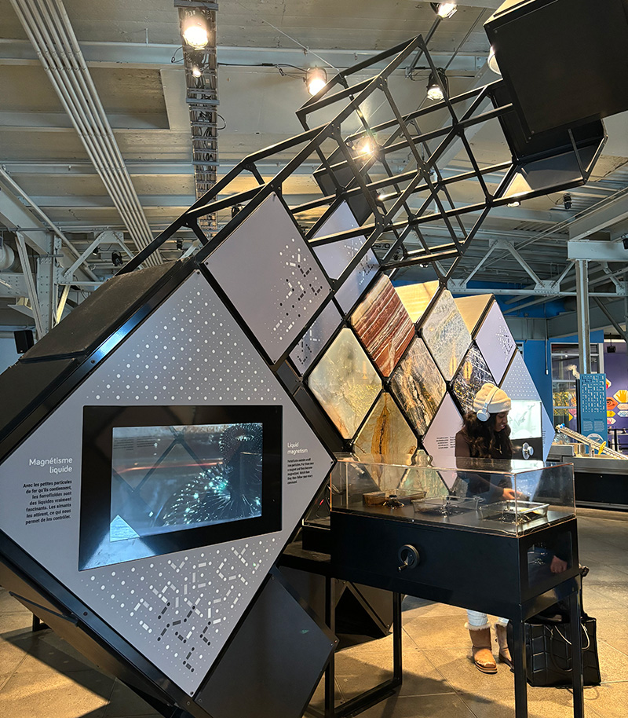
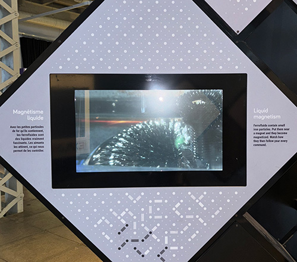
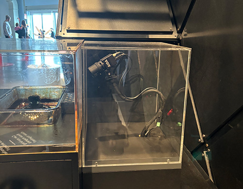
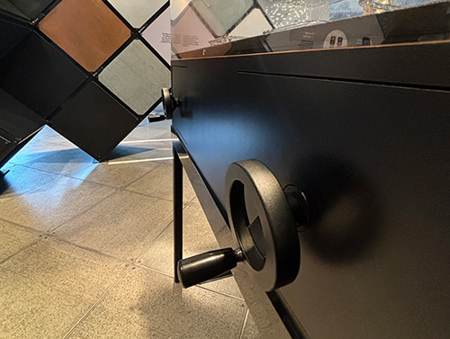
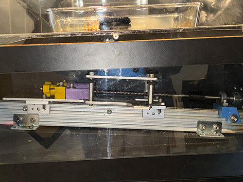
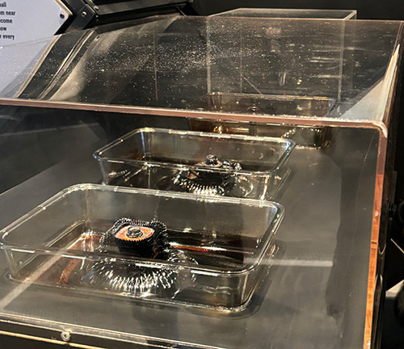
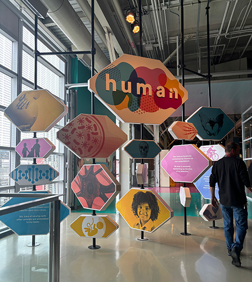

# Centre des sciences - Magnétisme liquide
> *2 Rue de la Commune O, Montréal QC H2Y 4B2*, 04-05-24

## Description du dispositif
*Magnétisme Liquide* est l'un des nombreux dispositifs qui étaient exposés au Centre des Sciences. C'est un projet dont le nom explique déjà de quoi il s'agit. Fondamentalement, il s'agit d'un projet qui explore le pouvoir d'une force magnétique supérieure par rapport aux forces régulières du pôle Nord et du pôle Sud d'un plus petit aimant. Les visiteurs qui viennent voir comment cela fonctionne sont invités à actionner la poignée en la faisant tourner, ce qui déplacera l'aimant plus puissant qui se trouve sous la table. Par conséquent, le liquide contenu dans le récipient ignorera la force soit du pôle Nord soit du pôle Sud du petit aimant, qu'il soit attiré ou non vers lui, et il suivra l'aimant plus grand.

## Type d'installation
*Magnétisme Liquide* semble être parmi les œuvres qui ont peut-être pris le moins de temps à organiser, mais cela a certainement nécessité sa part de temps pour être organisé. Ce projet est placé sur une table et est enfermé dans deux petits conteneurs qui sont eux dans un plus gros conteneur transparent. Tout au bout de la table, il y a une caméra dont le but est d'enregistrer et d'illustrer sur un écran à proximité chaque mouvement qui se produit dans les deux plus petits conteneurs du projet et elle est également dans un conteneur transparent pour la protéger. De plus, à l'extrémité opposée de la caméra, juste en dessous de la table, se trouve un espace contenant la partie mécanique du projet. Et c'est là que tout ce qui se passe lorsque la poignée tourne est visible. En d'autres mots, le mécanisme contenu dans cette espèce de boite est responsable du mouvement de l'aimant plus puissant sous la table, ce qui influence le comportement du liquide magnétique dans les conteneurs. Voici quelques images qui démontrent le tout:

#### 1. L'écran et la caméra
 

#### 2. Les poignets et le mécanisme
 

#### 3. Les contenants
 

## Mise en espace
Le projet dispose de son propre espace raisonnable sur tout l'étage. Il est placé parmi de nombreuses autres œuvres différentes. Les photos suivantes montreront différentes zones de la section d'exposition sur *L'humain* qui se trouvait à l'étage supérieur du bâtiment.

 

## Lieu - Centre des Sciences
Comme déjà mentionnée, le dispositif a eu lieu au Centre des Sciences de Montréal le 5 avril 2024. Ce centre est un musée scientifique qui est associé à la Société immobilière du Canada et qui vise à rendre la science accessible à tous en encourageant la connaissance et la culture scientifique et technologique. Il accompagne les visiteurs de tous âges dans la découverte et la compréhension de ces domaines pour les aider à façonner leur avenir.

## Expérience vécue
Les visiteurs sont invités à tourner une poignée qui est connectée à un gros aimant, et lorsque cela se produit, cela rend le liquide magnétique à l'intérieur du conteneur encore plus attiré vers lui, ce qui le pousse à ignorer la réaction qu'il devrait avoir en fonction du pôle auquel il est dirigé. Cela peut être vu dans la vidéo ci-dessous:

https://github.com/nurkouu/H24_V11_inspirations_RICHARD/assets/143274560/7b86bad7-62b2-4541-8212-a3c36e5215da

## Expérience personnelle
Personnellement, parmi toutes les  différentes et impressionnantes dispositifs qui étaient présentés, pour une raison quelconque, j'ai trouvé celle-ci la plus intéressante pour moi. Je pense que c'est parce que j'ai toujours été captivé par le magnétisme d'une certaine manière. J'ai aimé comment nous, en tant que visiteurs, avons pu interagir de manière si simple et comment nous avons pu voir ce que notre interaction faisait sous la table, et aussi j'ai pensé que l'idée de la caméra affichant en gros plan ce qui se passait était également excellente. Enfin, je ne changerais rien, car je pense que ce projet était bien réalisé.

## Site Web
https://www.centredessciencesdemontreal.com/

